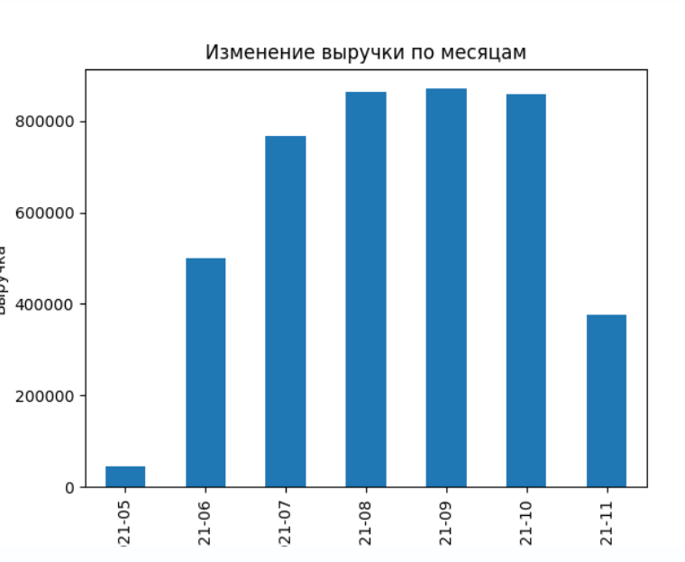

# 1. Вопросы:

1) Как хорошо Вы владеете Python? Оцените свой уровень по шкале от 0 до 10,
где 0 - совсем не знаю, 10 - владею в совершенстве.
Объясните, почему Вы выбрали такой балл.

**Ответ:**
Могу оценить на 5. Знаю хорошо базу, ООП, остальные 5 - это реальный опыт в проектах.

2) Насколько хорошо Вы знакомы с Google Sheets? Оцените свой уровень по
шкале от 0 до 10, где 0 - совсем не знаю, 10 - владею в совершенстве.
Объясните, почему Вы выбрали такой балл.

**Ответ:**
Оцениваю на 8. Так как это почти то же самое, что и Excel. С MS Excel была связана моя предыдущая работа, 
где приходилось создавать макросы, строить графики и использовать формулы. Поэтому я вполне уверена в знаниях.

# 2. Задачи на логику:

1) Рекламная кампания стартовала вчера с дневным бюджетом 40 $. Половина
бюджета была израсходована к полудню, а 80% оставшегося бюджета было
потрачено между полуднем и временем закрытия. Сколько долларов не было
потрачено?

**Ответ:**
4 $

2) 5 идентичных рекламных кампаний работали 24 дня по 6 часов в день,
потрачено было 120 долларов. Сколько дней они работали бы на 216 долларов,
если бы 9 одинаковых кампаний работали бы по 8 часов в день?

**Ответ:**
18 дней

3) Дизайнеры создали 200 рекламных баннеров для двух рекламных кампаний. 80
из них не использовались ни в кампании No1, ни в кампании No2, 60
использовались только в кампании No1. И для каждого рекламного баннера,
который использовался в обеих кампаниях, приходится 3 баннера, которые
использовались только в кампании No2. Сколько баннеров было использовано в
обеих рекламных кампаниях?

**Ответ:**
45 баннеров

4) Энн использует Instagram, но не Facebook, а Джон использует Youtube и
Facebook. Кейт использует Youtube, но не Instagram, а Том использует Facebook,
но не Youtube. Если каждый человек использует две из трех социальных сетей,
у кого предпочтения совпадают?

**Ответ:**
Предпочтения совпадают у Джона и Кейт (Фэйсбук и Ютуб)

5) Средний итоговый балл стажера по 4 модулям составляет 78 баллов. Сколько
баллов должен получить стажер за 5-й модуль, чтобы средний балл по всему
заданию составил 80?

**Ответ:**
88 баллов за 5 модуль

6) Заказанные в приложении товары доставляются на автомобиле. Автомобиль
проезжает 260 км со средней скоростью 80 км / ч. На обратном пути машина
движется со средней скоростью 100 км / ч. Насколько быстрее был обратный
путь? Ответ: указать в минутах.

**Ответ:**
39 минут

# 3. Техническое задание

Техническое задание полностью выполняется с помощью языка программирования
Python. В таблице Excel НЕЛЬЗЯ вносить какие-либо изменения вручную.
В файле «data.xlsx» представлены данные по поступлению денежных средств от
клиентов компании N за покупку ее услуг.
Имеющиеся поля:

● client_id - ID клиента;

● sum – сумма денежных средств;

● status – статус оплаты;

● sale – менеджер, заключивший сделку;

● new/current – статус сделки;

● document – наличие оригинала подписанного договора с клиентом;

● receiving_date – дата получения оригинала договора.

## Вопросы:
1) Вычислите общую выручку за июль 2021 по тем сделкам, приход денежных
средств которых не просрочен.
2) Как изменялась выручка компании за рассматриваемый период?
Проиллюстрируйте графиком.
3) Кто из менеджеров привлек для компании больше всего денежных средств в
сентябре 2021?
4) Какой тип сделок (новая/текущая) был преобладающим в октябре 2021?
5) Сколько оригиналов договора по майским сделкам было получено в июне 2021?

**Ответ**

Файл с кодом по расчету представлен в файле ex_1.py

1. Общая выручка за июль 2021: 766734.4399999997
2. График изменения выручки по месяцам

3. Менеджер с наибольшей выручкой в сентябре 2021: Петрова
4. Преобладающий тип сделок в октябре 2021: текущая
5. Количество оригиналов договоров, полученных в июне 2021: 76

## Задание:

За каждую заключенную сделку менеджер получает бонус, который рассчитывается
следующим образом.

1) За новые сделки менеджер получает 7 % от суммы, при условии, что статус
оплаты «ОПЛАЧЕНО», а также имеется оригинал подписанного договора с
клиентом (в рассматриваемом месяце).

2) За текущие сделки менеджер получает 5 % от суммы, если она больше 10 тыс.,
и 3 % от суммы, если меньше. При этом статус оплаты может быть любым,
кроме «ПРОСРОЧЕНО», а также необходимо наличие оригинала подписанного
договора с клиентом (в рассматриваемом месяце).
Бонусы по сделкам, оригиналы для которых приходят позже рассматриваемого
месяца, считаются остатком на следующий период, который выплачивается по мере
прихода оригиналов. Вычислите остаток каждого из менеджеров на 01.07.2021.

**Ответ**

Файл с кодом по расчету представлен в файле ex_2.py

Остаток каждого менеджера на 01.07.2021:

* Андреев       37498.2167 
* Васильев      10623.0425 
* Иванов        35477.7990 
* Кузнецова     28448.5495 
* Михайлов        607.0680 
* Петрова       47160.6688 
* Селиванов      9532.4110 
* Смирнов       43653.7710 
* Соколов        7241.0940 
* Филимонова    16838.2445